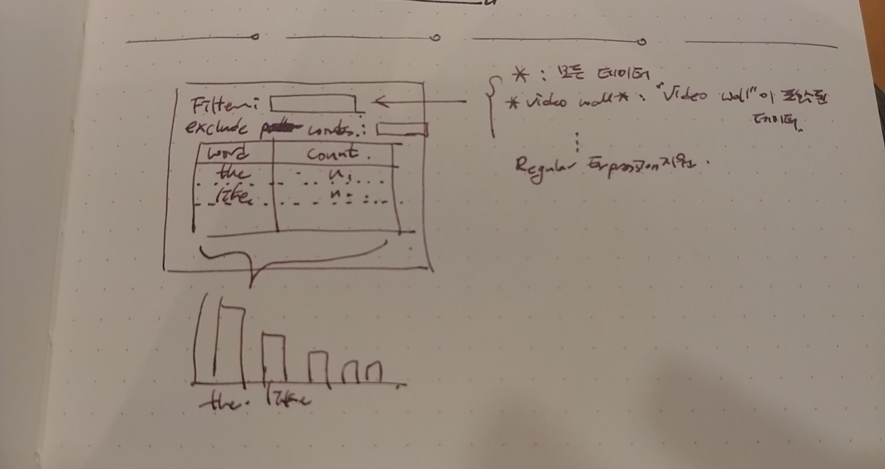

# word-counter

A word-counter project for Asella \
https://asella-word-counter.herokuapp.com/

## Requirement



## Prerequisite

* To install virtualenv
```bash
sudo pip install virtualenv
```
* To make an environment
```bash
virtualenv -p python3 [env_name]
```
* Enable the environment
```bash
source [env_name]/bin/activate
```
* Disable the environment
```bash
deactivate
```
* Install dependencies
```bash
pip install -r requirements.txt
```

## Execute

### Shell

```bash
python csv_word_counter.py data_science_bootcamps.csv \
    --column_name=MESSAGES \
    --include_pattern='PhD|12'\
    --exclude_pattern='\d+'
```

### Web server

```bash
python flask_upload.py
```

## Deploy

In this project, I use Heroku.com

### Prerequisite

* Install Heroku CLI

```bash
brew install heroku/brew/heroku
```

### Deploy

* Before to deploy, test on local machine

```bash
heroku local web
```

* Deploy to Heroku server \
  To deploy, push to Heroku git server

```bash
git push heroku master
```

* Get the log tails

```bash
heroku logs --tail
```

* Access URL: https://asella-word-counter.herokuapp.com/
